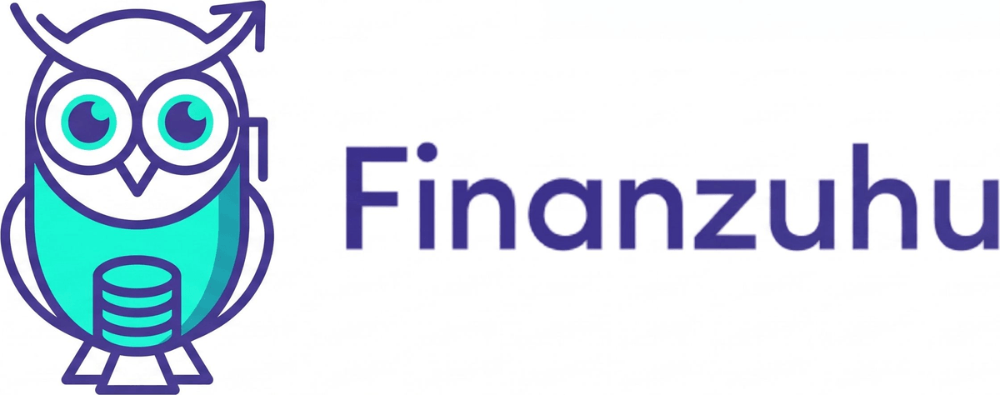

<div align="center">



# The AI-Assisted SDLC — walked end to end

**A workshop repository for running the complete Software Development Lifecycle
with AI support** — from the raw backlog entry to the updated documentation, on
a codebase that actually runs.


</div>

---

## What this repository is

Two things live here, and keeping them apart is the whole idea:

| | what it is | where |
| --- | --- | --- |
| **The process** | the SDLC with AI — its artifacts, standards and prompts. This is what the workshop is about. | [`sdlc/`](sdlc/README.md), [`docs/`](docs/README.md), [`prerequisites/`](prerequisites/README.md) |
| **The demo project** | **Finanzuhu**, a running personal-finance app. The thing the process is practised *on* — never the point in itself. | `src/`, `data/`, `tests/`, `public/` |

The app exists so the process has something real to bite into. It runs, it has
data, it has tests — so a story can be refined, planned, built, reviewed and
documented for real instead of in the abstract.

## The idea behind the process

AI does not only help with writing code, but at every station of the loop. This
repository covers the section from **Plan to Release** and makes it walkable:
each step produces a Markdown file that the next one reads as input.

```
unrefined  →  refined  →  plan  →  implementation  →  review  →  docs
              ↑ DoR                      ↑ tests       ↑ DoD       ↺
```

These files steer the AI and make its work repeatable, reviewable and shareable
across the team. A ticket travels visibly through the folders instead of
disappearing into a tool. The full reasoning is in
[`CONCEPT.md`](CONCEPT.md); the folder contract is in
[`sdlc/README.md`](sdlc/README.md).

## What we do over the next two weeks

One story at a time, through the full loop. We start slow — the first pass is
about understanding each step, not about throughput — and pick up pace once the
steering documents are in place and the loop feels familiar.

**First, the ground rules — once.** Two files are deliberately shipped empty:
[`sdlc/standards/architecture.md`](sdlc/standards/architecture.md) and
[`code_style.md`](sdlc/standards/code_style.md). We derive them *from the
running Finanzuhu code*, together with the AI, before the first implementation
plan. Definition of Ready and Definition of Done are already in the repository —
as illustrative material, not as the final word: we work both out again and
overwrite them.

**Then the loop, per story:**

1. **Plan** — a raw entry goes into `sdlc/backlog/unrefined/`, deliberately
   unfinished. We sharpen it against the DoR into `refined/`.
   → [`prompts/01_plan.md`](sdlc/standards/prompts/01_plan.md)
2. **Code** — an implementation plan first, reviewed in a fresh session, *then*
   the code. → [`prompts/02_code.md`](sdlc/standards/prompts/02_code.md)
3. **Test / Release** — review against the DoD in a separate session, findings
   assessed by hand, then rework.
   → [`prompts/03_test_release.md`](sdlc/standards/prompts/03_test_release.md)
4. **Documentation** — `docs/` and the steering documents brought back in line.
   → [`prompts/04_documentation.md`](sdlc/standards/prompts/04_documentation.md)

**How we work while doing it:**

- Every session ends with a **committed result**. No state stays only inside an
  AI session.
- Reviews run in a **fresh session** — whoever wrote the code is biased toward
  their own decisions, the AI as much as a human.
- When a prompt gets typed a third time, it becomes a **skill** and is called
  with `/skill-name` from then on.
- **Tests you have not seen fail are worthless.**

The cadence is not fixed in advance. What is fixed is the order of the steps and
the artifact each one leaves behind.

## The demo project: Finanzuhu

*The uhu is an eagle owl — the friendly Finanzguru relative.* It needs nothing
but Node:

```bash
npm install
npm run dev     # http://localhost:3000
npm test        # the two example tests on the money math
```

Two screens. **Overview** (`/`) answers *how much money do we have*: balance,
free-to-spend, a cashflow chart over week / month / three months, in-out-net
tiles, the top categories and the last eight bookings. **Transactions**
(`/transactions`) is the full ledger — searchable, filterable by category and
direction, sortable by date and amount.

**The stack:** Next.js 15 (App Router, TypeScript strict), Tailwind CSS v4,
shadcn/ui, TanStack Query v5, Recharts, Vitest. Deliberately absent: validation
library, date library, state manager, ORM, test pyramid. Someone who does not
write TypeScript daily has to feel at home here.

**The data is static and deterministic.** All numbers come from
[`data/transactions.csv`](data/transactions.csv), 131 committed bookings for a
fictional household, plus the opening balance in
[`data/account.json`](data/account.json). There is no database and no clock:
"today" is the last booking in the file, so the app shows the same numbers on
every machine on every day — do not regenerate it.
`node scripts/check-data.mjs` re-checks the ledger.

**The seams a story can use:** a UI seam (new card, new page), an API seam
(`/api/summary`, `/api/transactions` — new endpoint or params), and a domain
seam (a new pure function in `src/lib/finance.ts`, testable in isolation).
Not built on purpose, and therefore fair game: budgets per category,
recurring-contract detection, forecast to end of month, savings goals, CSV
import via upload, multi-account, a tagging/rules engine.

<details>
<summary><strong>Brand assets</strong></summary>

| asset | where it is used |
| --- | --- |
| [`assets/logo_finanzuhu.jpeg`](assets/logo_finanzuhu.jpeg) | the source artwork — everything below is cut from it |
| `public/finanzuhu-logo.png` | full lockup, trimmed — the app header (`src/components/layout/brand.tsx`), README, Open Graph |
| `src/app/favicon.ico`, `icon.png`, `apple-icon.png` | the owl alone — browser tab and home screen |

The two brand colours live in [`src/app/globals.css`](src/app/globals.css) as
`--owl` (the violet) and `--owl-accent` (the teal); charts, focus rings and the
active navigation item all derive from them, in both themes.

</details>

## Layout

```
sdlc/            the process — backlog artifacts, standards, prompts
docs/            architecture documentation, diagrams, decisions
prerequisites/   background material: the SDLC refresher and the slides
─────────────────────────────────────────────────────────────────────
src/             the Finanzuhu app — app router, features, lib
data/            the committed ledger the app reads
tests/           test code and test data
public/          brand assets served by the app
scripts/         check-data.mjs, verifies the ledger
assets/          logo and workshop imagery
```

Every folder explains itself in its own `README.md`.

## Where to start

| I want to… | |
| --- | --- |
| understand how we work here | [`CONCEPT.md`](CONCEPT.md) |
| know what goes in which folder | [`sdlc/README.md`](sdlc/README.md) |
| get the prompt for a step | [`sdlc/standards/prompts/`](sdlc/standards/prompts/README.md) |
| refresh the SDLC material | [`prerequisites/`](prerequisites/README.md) |
| look at the app | `npm install && npm run dev` |

---

<div align="center">
  <a href="https://www.codecentric.de/">
    
  </a>
  <br>
  <sub>Created in the workshop <em>AI-Assisted Coding</em> ·
  <a href="https://www.codecentric.de/">codecentric AG</a></sub>
</div>
