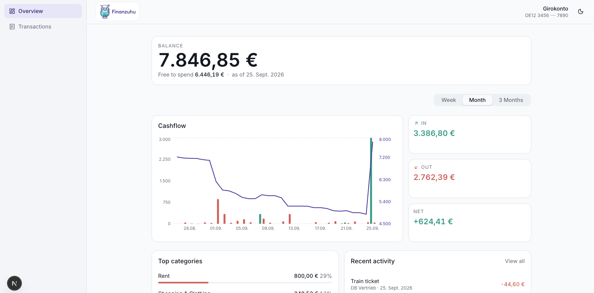

<div align="center">


# AI-Assisted SDLC Base Repository

**A starter project for AI-assisted development. Make it whatever you need.**


</div>

## Quickstart

```bash
npm install
npm run dev     # http://localhost:3000
npm test
```

Then take the first ticket through the loop in OpenCode:

```text
/refine-ticket ST-001
```

## How to use it

- **Workshop:** branch `ai-enablement-<n>` off `main`.
- **On your own:** fork it.
- **Other tools:** rename `.opencode/` to `.claude/` (Claude Code) or
  `.github/` (Copilot). All of them read [`AGENTS.md`](AGENTS.md).

The branch `ai-enablement-1` shows where the first workshop ended up.

## Find your way

| read                                              | to learn                                          |
| ------------------------------------------------- | ------------------------------------------------- |
| [`CONCEPT.md`](CONCEPT.md)                        | the idea, the default flow and the harness        |
| [`sdlc/README.md`](sdlc/README.md)                | the flow: which ticket file goes where            |
| [`.opencode/skills/`](.opencode/skills/README.md) | one skill per step                                |
| [`sdlc/standards/`](sdlc/standards/)              | Definition of Ready / Done, architecture, prompts |

## Finanzuhu, the starter app



Two screens: **Overview** (`/`) and **Transactions** (`/transactions`).
Next.js 15, Tailwind v4, shadcn/ui, TanStack Query, Recharts, Vitest.

- **Static data:** `data/transactions.csv` and `data/account.json`. No
  database, no clock, the same numbers on every machine.
- **Seams:** UI (cards, pages), API (`/api/summary`, `/api/transactions`),
  domain (pure functions in `src/lib/finance.ts`).

Demo only, not a real financial product.

<div align="center">
  <a href="https://www.codecentric.de/">
    
  </a>
  <br>
  <sub>Created in the workshop <em>AI-Assisted Coding</em> ·
  <a href="https://www.codecentric.de/">codecentric AG</a></sub>
</div>
