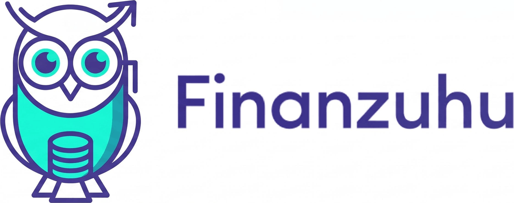
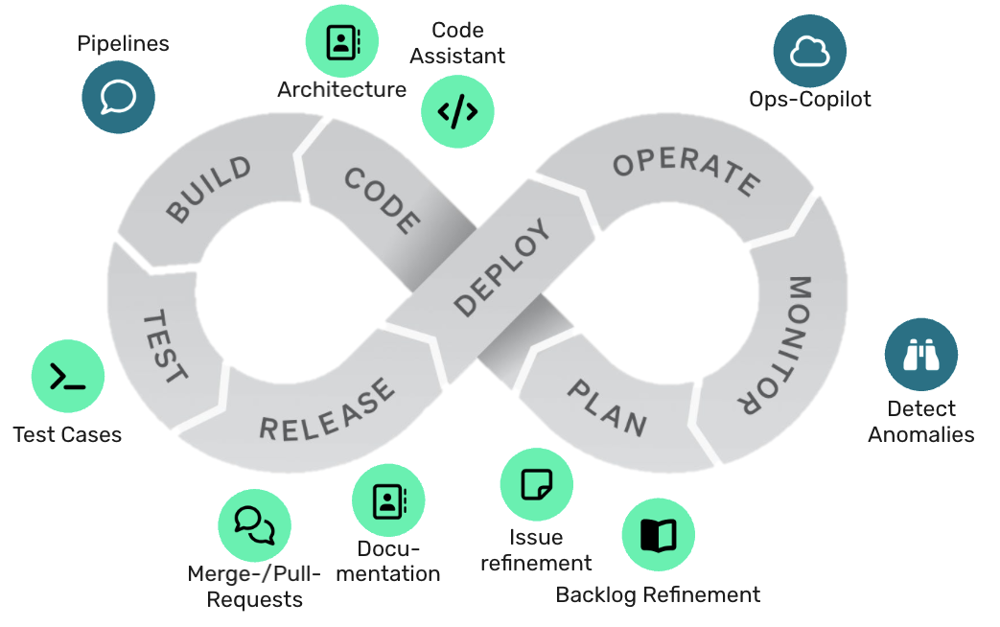
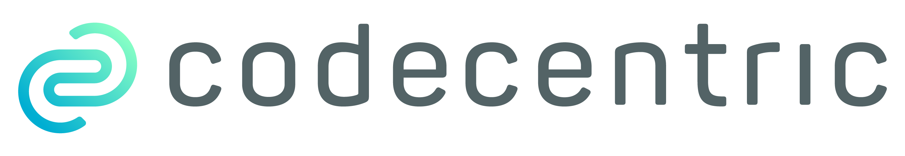

<div align="center">



# The AI-Assisted SDLC — walked end to end

**A workshop repository for running the complete Software Development Lifecycle
with AI support** — from the raw backlog entry to the updated documentation, on
a codebase that actually runs.



</div>

---

**Finanzuhu is a demo project** — a simple financial advisor app built to demonstrate the SDLC in practice. Its sole and only purpose is to teach
AI-assisted coding; it is not a real financial product.

## What this repository is

Two things live here, and keeping them apart is the whole idea:

|                      | what it is                                                                                                          | where                                                                                             |
| -------------------- | ------------------------------------------------------------------------------------------------------------------- | ------------------------------------------------------------------------------------------------- |
| **The process**      | the SDLC with AI — its artifacts, standards and prompts. This is what the workshop is about.                        | [`sdlc/`](sdlc/README.md), [`docs/`](docs/README.md), [`prerequisites/`](prerequisites/README.md), [`AGENTS.md`](AGENTS.md), [`.github/`](.github/README.md) |
| **The demo project** | **Finanzuhu**, a running personal-finance app. The thing the process is practised _on_ — never the point in itself. | `src/`, `data/`, `tests/`, `public/`                                                              |

The app exists so the process has something real to bite into. It runs, it has
data, it has tests — so a story can be refined, planned, built, reviewed and
documented for real instead of in the abstract.

## The idea behind the process

AI does not only help with writing code, but at every station of the loop. This
repository covers the section from **Plan to Release** and makes it walkable:
each step produces a Markdown file that the next one reads as input.

```
unrefined  →  refined  →  plan  →  implementation  →  review  →  docs
              ↑ DoR                      ↑ tests       ↑ DoD       ↺
```

These files steer the AI and make its work repeatable, reviewable and shareable
across the team. A ticket travels visibly through the folders instead of
disappearing into a tool. The full reasoning is in
[`CONCEPT.md`](CONCEPT.md); the folder contract is in
[`sdlc/README.md`](sdlc/README.md).

## Guides & Sensors

As the process runs, two kinds of artifacts accumulate around it: things that
**steer** the AI's work before it happens, and things that **check** it
afterwards.

- **Guides** — steer the work. Standards, prompts, instructions the AI reads
  before it acts.
- **Sensors** — check the work. Linters, tests, reviews that catch problems
  after the AI has acted.

Each splits again by how it runs:

- **Computational** — deterministic, machine-run, no AI in the loop.
- **Inferential** — needs judgement, runs through an LLM (a prompt, a skill,
  an AI review).

|                    | Guides (steer)                                                                                                                                               | Sensors (check)                                                                                                            |
| ------------------ | --------------------------------------------------------------------------------------------------------------------------------------------------------- | ---------------------------------------------------------------------------------------------------------------------------- |
| **Computational**  | _none yet — see ideas below_                                                                                                                                | `npm run lint` ([`eslint.config.mjs`](eslint.config.mjs)) · `npm test` (Vitest)                                              |
| **Inferential**    | the [6 standard prompts](sdlc/standards/prompts/README.md) · [`definition_of_ready.md`](sdlc/standards/definition_of_ready.md) · [`definition_of_done.md`](sdlc/standards/definition_of_done.md) · `architecture.md` (empty, to be derived) | [`04a_review_implementation.md`](sdlc/standards/prompts/04a_review_implementation.md) (AI review against the DoD)            |

The cell that's empty today, and anything else we think of along the way,
goes into
[`sdlc/harness-improvement-ideas/`](sdlc/harness-improvement-ideas/README.md)
until it's actually built. [`.github/`](.github/README.md) is the skeleton
for the GitHub Copilot / VS Code side of Guides — project instructions,
scoped instructions, skills — ready to fill in as those ideas land.

## Intended use of project

One story at a time, through the full loop: unrefined → refined → plan → code
→ review → docs. `sdlc/standards/architecture.md` is deliberately shipped
empty and derived from the running code first; Definition of Ready and
Definition of Done are illustrative starting points, not the final word.

**Ground rules while doing it:**

- Every session ends with a **committed result**.
- Reviews run in a **fresh session**.
- A prompt typed a third time becomes a **skill**.
- **Tests you have not seen fail are worthless.**

## The demo project: Finanzuhu

_The uhu is an eagle owl — the friendly Finanzguru relative._ It needs nothing
but Node:

```bash
npm install
npm run dev     # http://localhost:3000
npm test        # the two example tests on the money math
```

Two screens. **Overview** (`/`) answers _how much money do we have_: balance,
free-to-spend, a cashflow chart over week / month / three months, in-out-net
tiles, the top categories and the last eight bookings. **Transactions**
(`/transactions`) is the full ledger — searchable, filterable by category and
direction, sortable by date and amount.

**The stack:** Next.js 15 (App Router, TypeScript strict), Tailwind CSS v4,
shadcn/ui, TanStack Query v5, Recharts, Vitest. Deliberately absent: validation
library, date library, state manager, ORM, test pyramid. Someone who does not
write TypeScript daily has to feel at home here.

**The data is static and deterministic.** All numbers come from
[`data/transactions.csv`](data/transactions.csv), 131 committed bookings for a
fictional household, plus the opening balance in
[`data/account.json`](data/account.json). There is no database and no clock:
"today" is the last booking in the file, so the app shows the same numbers on
every machine on every day — do not regenerate it.
`node scripts/check-data.mjs` re-checks the ledger.

**The seams a story can use:** a UI seam (new card, new page), an API seam
(`/api/summary`, `/api/transactions` — new endpoint or params), and a domain
seam (a new pure function in `src/lib/finance.ts`, testable in isolation).
Not built on purpose, and therefore fair game: budgets per category,
recurring-contract detection, forecast to end of month, savings goals, CSV
import via upload, multi-account, a tagging/rules engine.

<details>
<summary><strong>Brand assets</strong></summary>

| asset                                                      | where it is used                                                                              |
| ---------------------------------------------------------- | --------------------------------------------------------------------------------------------- |
| [`assets/logo_finanzuhu.jpeg`](assets/logo_finanzuhu.jpeg) | the source artwork — everything below is cut from it                                          |
| `public/finanzuhu-logo.png`                                | full lockup, trimmed — the app header (`src/components/layout/brand.tsx`), README, Open Graph |
| `src/app/favicon.ico`, `icon.png`, `apple-icon.png`        | the owl alone — browser tab and home screen                                                   |

The two brand colours live in [`src/app/globals.css`](src/app/globals.css) as
`--owl` (the violet) and `--owl-accent` (the teal); charts, focus rings and the
active navigation item all derive from them, in both themes.

</details>

## Where to start

| I want to…                     |                                                               |
| ------------------------------ | ------------------------------------------------------------- |
| understand how we work here    | [`CONCEPT.md`](CONCEPT.md)                                    |
| know what goes in which folder | [`sdlc/README.md`](sdlc/README.md)                            |
| see what Guides & Sensors exist | [`#guides--sensors`](#guides--sensors) above, ideas in [`sdlc/harness-improvement-ideas/`](sdlc/harness-improvement-ideas/README.md) |
| get the prompt for a step      | [`sdlc/standards/prompts/`](sdlc/standards/prompts/README.md) |
| refresh the SDLC material      | [`prerequisites/`](prerequisites/README.md)                   |
| look at the app                | `npm install && npm run dev`                                  |

---

<div align="center">
  <a href="https://www.codecentric.de/">
    
  </a>
  <br>
  <sub>Created in the workshop <em>AI-Assisted Coding</em> ·
  <a href="https://www.codecentric.de/">codecentric AG</a></sub>
</div>
